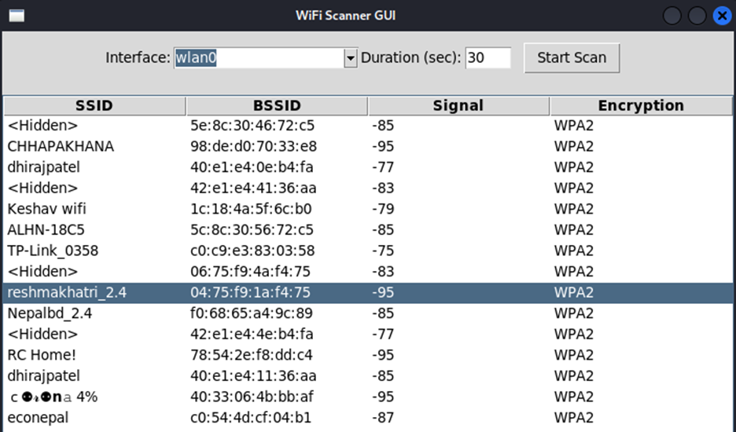
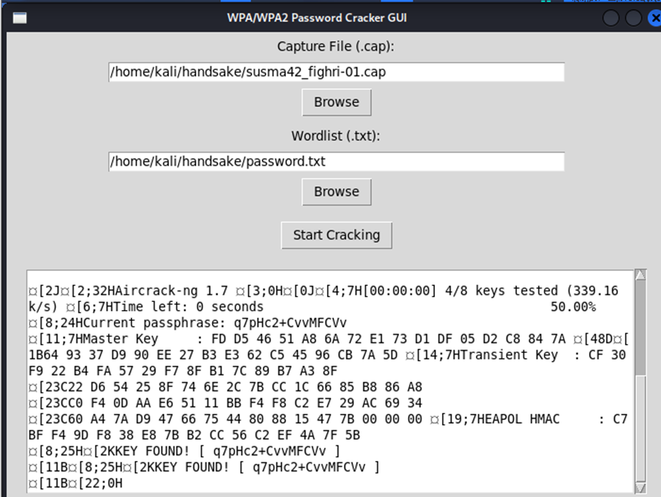

# Wi-Fi Security Tool

This project is a Python-based Wi-Fi Security Tool featuring a GUI Wi-Fi Scanner and a WPA/WPA2 Password Cracker. The scanner detects nearby networks, showing SSID, BSSID, signal strength, and encryption type, while the password cracker tests WPA/WPA2 passwords using a wordlists.

---

## Project Objectives
- Apply wireless security concepts in practical implementation  
- Develop a GUI-based Wi-Fi Scanner  
- Develop a GUI-based Password Cracker  
- Understand vulnerabilities in weak wireless password configurations  

---

## Features

### Wi-Fi Scanner Module
- Passive IEEE 802.11 beacon frame detection  
- Displays: 
  - SSID  
  - BSSID  
  - Signal Strength (dBm)  
  - Encryption Type  
- Detects hidden networks  
- GUI built with Tkinter  
- Validates root privileges  

### WPA/WPA2 Password Cracker Module
- Analyzes WPA handshake capture files (.cap)  
- Extracts BSSID automatically  
- Performs dictionary-based attack  
- Real-time cracking output display  
- Handles errors:  
  - No handshake found  
  - Password not in dictionary  
  - Insufficient privileges
- GUI built in Tkinter

---

## Technologies Used
- Python 3  
- Scapy  
- Tkinter  
- Aircrack-ng  
- Linux (Kali Linux recommended)  

---

## Project Structure
```
wifi-security-tool/
│
├── scanner.py              # GUI Wi-Fi Scanner module (Beacon frame capture using Scapy)
├── password_cracker.py     # GUI WPA/WPA2 dictionary-based password tester (uses Aircrack-ng)
├── requirements.txt        # Python dependencies required to run the project
├── README.md               # Project documentation and usage instructions
│
├── wordlists/              # Folder containing sample dictionary files
│   └── sample_wordlist.txt # Small demo wordlist for testing password strength
│
└── screenshots/            # Application output screenshots
    ├── scanner_output # Screenshot of Wi-Fi Scanner detecting networks
    └── cracker_success # Screenshot showing successful password cracking
```
---

## Installation
1. Clone the repository:
   ```
   git clone https://github.com/yourusername/wifi-security-tool.git
   cd wifi-security-tool```
2. Install System Dependencies (Linux)
   ```
   sudo apt update
   sudo apt install aircrack-ng python3 python3-pip python3-venv```
4. Create Virtual Environment
   ```
   python3 -m venv wifi_venv
   source wifi_venv/bin/activate```
6. Install Python Dependencies
   ```
   pip install -r requirements.txt```
   
---

## Running the Applications
### Wi-Fi Scanner
```
sudo python3 wifi_scanner.py
```
### WPA/WPA2 Password Cracker
```
sudo python3 password_cracker.py
```

---

## Application Screenshots
### Wi-Fi Scanner Ouput


### WPA/WPA2 Password Cracker Ouput


---

## How It Works
### Wi-Fi Scanner
- Uses Scapy to capture 802.11 beacon frames
- Extracts network metadata (SSID, BSSID, signal strength, encryption)
- Updates GUI table dynamically
- Prevents duplicate BSSID entries

### Password Cracker
- Uses Aircrack-ng for handshake analysis
- Validates presence of WPA handshake
- Performs dictionary-based attack
- Displays cracking progress in real time

---

## References
- Aircrack-ng Project
- Scapy Developers
- Python Software Foundation
